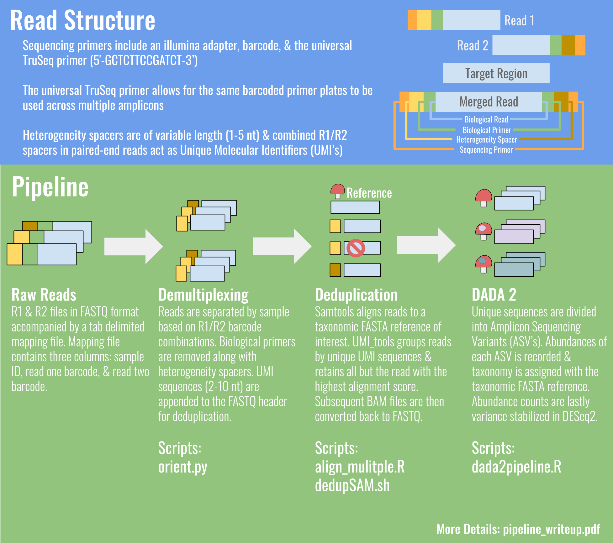

# bgmp-group-project-vineyard_fungal_assessment
Pipeline for demultiplexing, deduplication, DADA2, & variance transformation of amplicon sequencing data
generated from a novel adapter scheme developed in the McGuire Lab (University of Oregon)

All dependancies required to run this pipeline exist within enviroment XG26.yml 

prior to running this pipeline please install the enviroment from the.yml file located in the env folder

$conda env create --name XGboost --file=XG26.yml
$conda activate XGboost

All relavent .sh and .py files required for our pipeline are located within the scripts folder

Analysis and results generated on TALAPAS

NOTE : While running on Talapas the given .sh scripts need to be given #sbatch parameters and the first script requires to be executed in the same folder as the sam files you wish to run analysis on.

